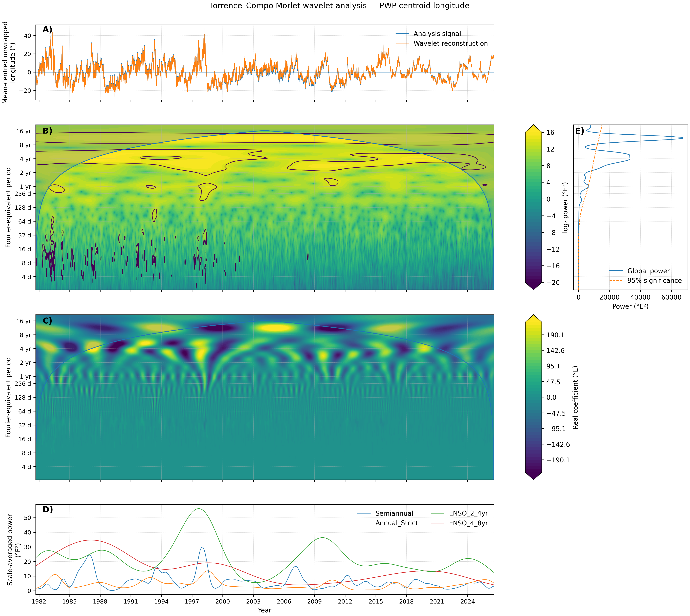
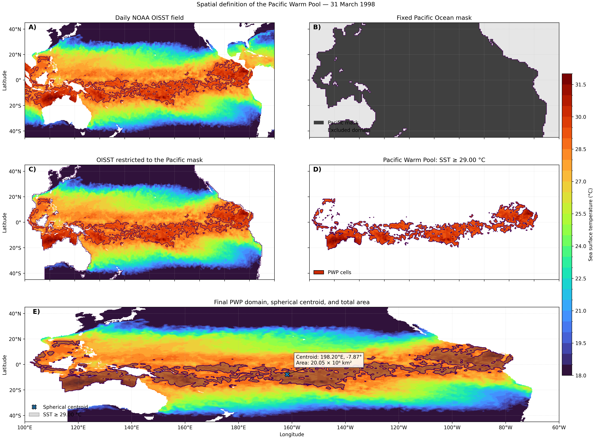
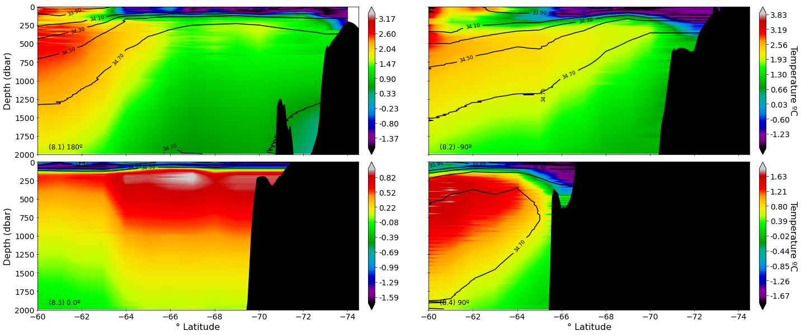

  

<h1 align="center">Fabio Vieira Machado</h1>

  <strong>Oceanographer | Hydrographic & Offshore Survey | Metocean | Scientific Data</strong>

  <em>From measurements at sea to defensible scientific information.</em>

  <strong>20+ years spanning offshore survey operations, oceanographic observations, marine geophysics, subsea project support, scientific data analysis and climate research.</strong>

  Based in New Zealand | Available for consulting, project-based and fixed-term assignments nationally and internationally

---

## Connect

**Email:** [fvmachado.oceanscience@gmail.com](mailto:fvmachado.oceanscience@gmail.com)
**ORCID:** [0000-0003-0723-075X](https://orcid.org/0000-0003-0723-075X)
**GitHub:** [blackbeltbjj](https://github.com/blackbeltbjj)

---

## Work With Me

I am open to **consulting, project-based and fixed-term assignments** where oceanographic knowledge, offshore experience and quantitative data analysis can contribute to solving scientific or operational problems.

Areas where I can contribute include:

- Hydrographic, offshore and marine geophysical survey projects
- AUV/HUGIN and subsea survey operations
- Marine and metocean data analysis
- Oceanographic observational programmes and environmental monitoring
- Hydrographic and oceanographic data QA/QC
- Scientific Python development and legacy scientific-data modernisation
- Climate and ocean time-series analysis
- Research software, reproducibility and research-data management
- Technical and scientific reporting
- Scientific collaboration and education using authentic environmental observations

**New Zealand and international projects welcome.**

---

## Areas of Professional Interest

**Hydrographic Survey | Offshore Survey | Physical Oceanography | Metocean**

**Marine Geophysics | Underwater Acoustics | Subsea Positioning | AUV Operations**

**Oceanographic Instrumentation | Environmental Monitoring | Ocean Observations**

**Climate Variability | ENSO | Pacific Warm Pool | Satellite Oceanography**

**Scientific Python | Environmental Data Science | Time-Series Analysis**

**Reproducible Research | Scientific Software | Research Data Management**

---

## Professional Profile

I am an oceanographer, hydrographic survey professional and scientific data specialist whose career bridges **field operations and quantitative science**.

My experience spans satellite oceanography and climate research, vessel-based hydrographic and marine-geophysical surveys, AUV/HUGIN and multibeam operations, acoustic positioning, oceanographic instrumentation, subsea project support, environmental observations, scientific computing and reproducible ocean and climate research.

I have worked across the complete data lifecycle:

**sensor deployment -> positioning -> real-time acquisition -> processing -> QA/QC -> analysis -> interpretation -> technical and scientific reporting**

This combination allows me to understand environmental and survey data not simply as numerical products, but as measurements shaped by instrumentation, positioning, environmental conditions, acquisition procedures and physical processes.

---

## Professional Capabilities

| Hydrographic & Offshore Survey | Oceanography & Metocean | Scientific Data |
| --- | --- | --- |
| Multibeam bathymetry | Physical oceanography | Python & MATLAB |
| AUV/HUGIN operations | CTD/SVP observations | Large environmental datasets |
| High-resolution AUV surveys | ADCP/current measurements | NetCDF / gridded data |
| Seabed mapping | Oceanographic moorings | Statistics & time-series |
| Side-scan sonar | Waves and currents | Fourier & wavelet analysis |
| Sub-bottom profiling | Satellite oceanography | Spatial analysis |
| Offshore/subsea positioning | SST / ENSO / climate variability | Scientific visualisation |
| Pipeline & as-built surveys | Environmental monitoring | Automated QA/QC |
| Dredging & backfilling | Marine observations | Reproducible workflows |

---

## Hydrographic, AUV & Offshore Survey

### Survey & Processing Software

`CARIS HIPS / SIPS` | `Kongsberg SIS` | `Hydromap Multibeam` | `Fledermaus` | `NavLab` | `Hypack / Hysweep`

### Survey Applications

- Hydrographic and marine geophysical surveys
- Multibeam bathymetry and high-resolution seabed mapping
- AUV high-resolution survey acquisition and processing
- Real-time and post-processed hydrographic data
- Side-scan sonar and sub-bottom profiling
- Pipeline-route, pre-lay, post-lay and as-built surveys
- Shore approaches, dredging and backfilling monitoring
- Offshore navigation and acoustic positioning
- Environmental survey support
- Survey planning and field execution
- Real-time marine geophysical data analysis
- Survey QA/QC and technical reporting

### Acoustic Positioning & Subsea Navigation

`Kongsberg HiPAP` | `APOS` | `C-NAV DGPS` | `USBL` | `LBL` | `AUV / HUGIN`

Experience with offshore navigation, subsea acoustic positioning and autonomous survey operations, including AUV mission support and integration of navigation, positioning and survey data. My background in physical oceanography and underwater acoustics provides additional understanding of environmental influences on sound propagation and subsea positioning.

### Multibeam, Sonar & Marine Geophysical Systems

`Kongsberg EM 2042` | `EM 2040 MKII` | `EM 712 / EM 712S` | `EM 710` | `EM 302` | `EM 3000`

`MBES` | `Side-Scan Sonar` | `Sub-Bottom Profiler` | `Marine Geophysics`

Applications have included high-resolution seabed mapping, pipeline and subsea-infrastructure surveys, route investigation, environmental surveys and offshore project support.

---

## Oceanographic Instrumentation & Field Operations

### CTD Systems & Sensors - Sea-Bird Scientific

`SBE 19+ SeaCAT` | `SBE 19+ V2 SeaCAT` | `SBE 3+ Temperature` | `SBE 4+ Conductivity` | `SBE 5e Pump` | `SBE 37 MicroCAT`

**Acquisition & Processing:** `SeaTerm` | `Seasave` | `SBE Data Processing`

Experience includes instrument configuration, CTD deployment, real-time acquisition, data conversion, filtering, alignment, QA/QC and interpretation of physical-oceanographic profiles.

### ADCP, Currents & Mooring Systems

`Teledyne RDI Workhorse Long Ranger 75 kHz` | `Teledyne RDI Workhorse Sentinel 300 / 600 / 1200 kHz` | `Nortek Aquadopp Profiler / Current Meter`

**Software:** `PlanADCP` | `WinADCP` | `WinSC` | `BBTalk`

Experience includes ADCP and DVL acquisition and processing, current profiling, oceanographic mooring installation and recovery, instrument configuration, acoustic releases, Teledyne Benthos R-Series systems, wave/current observations, environmental monitoring and associated QA/QC.

### Marine Sampling & Observational Systems

Multi-bottle rosette systems | Nansen bottles | Plankton nets | Box-core sediment samplers | Oceanographic moorings | Wave buoys | CTD/SVP casts | Current-meter deployments

Working directly with instruments and field observations provides important context when assessing the quality, uncertainty and physical meaning of environmental datasets.

---

## Scientific Computing & Environmental Data

**Languages & environments:**

`Python` | `MATLAB` | `Unix / Linux` | `Windows` | `Git` | `GitHub` | `Jupyter` | `VS Code`

**Python scientific stack:**

`NumPy` | `pandas` | `SciPy` | `xarray` | `Statsmodels` | `Matplotlib` | `PyWavelets`

### Analytical Capabilities

- Python-based scientific data analysis
- Large multidimensional ocean and climate datasets
- NetCDF and gridded geophysical observations
- Satellite sea-surface temperature
- Statistical and time-series analysis
- Spatial analysis and spherical geometry
- Connected-component analysis
- Fourier and wavelet analysis
- Welch power spectral density
- Continuous wavelet transforms
- STL decomposition
- Robust trend estimation
- Occurrence and persistence analysis
- Geospatial and satellite-data analysis
- Scientific visualisation
- Automated QA/QC
- Scientific provenance
- Reproducible computational workflows
- Research-data management

---

## Publications, Software & Reproducibility

My current research links scientific manuscripts with version-controlled computational workflows, audited software releases and persistent archival records where available.

### Pacific Warm Pool - Threshold Definition & Centroid Geometry

**Manuscript:** *Defining the Pacific Warm Pool: Threshold Dependence of Centroid Geometry and Robustness of Interannual Variance Modulation*

**Journal:** Journal of Atmospheric and Oceanic Technology
**Status:** Submitted 18 August 2026

The study examines how 28.0, 28.5 and 29.0 degrees C SST definitions alter diagnosed Pacific Warm Pool area, centroid position, spatial geometry and displacement, while assessing the robustness of interannual variance modulation across thresholds.

**Scientific software and data:**

- [OSAF-PWP](https://github.com/blackbeltbjj/OSAF-PWP) - [v1.0.0](https://github.com/blackbeltbjj/OSAF-PWP/releases/tag/v1.0.0) - [Zenodo DOI: 10.5281/zenodo.21964951](https://doi.org/10.5281/zenodo.21964951)
- [pwp-threshold-centroid-sensitivity](https://github.com/blackbeltbjj/pwp-threshold-centroid-sensitivity) - [v1.0.0](https://github.com/blackbeltbjj/pwp-threshold-centroid-sensitivity/releases/tag/v1.0.0) - [Zenodo DOI: 10.5281/zenodo.21964955](https://doi.org/10.5281/zenodo.21964955)
- Derived Data v1.0.0 - [Zenodo DOI: 10.5281/zenodo.21976955](https://doi.org/10.5281/zenodo.21976955)

**Methods:** Spherical geometry | Physical-area weighting | Threshold sensitivity | Centroid analysis | Connectivity | Wavelets | Occurrence & persistence

  

### Pacific Warm Pool - 28 C Area Expansion & Spatial Organization

**Manuscript:** *Variability, Expansion and Spatial Organization of the 28 degrees C Pacific Warm Pool from 1981 to 2026*

**Journal:** Revista Brasileira de Meteorologia
**Status:** Submitted 28 August 2026; anonymous review

The study examines daily PWP28 area, long-term expansion, seasonality, temporal variability and spatial connectivity using NOAA OISST v2.1. The supporting repository is currently maintained privately during review.

### Pacific Warm Pool - Largest Connected Component

**Manuscript:** *Expansion and Increasing Spatial Coherence of the Largest Connected Pacific Warm Pool, 1981-2026*

**Journal:** Journal of Climate
**Status:** Submitted 6 September 2026

The study investigates the long-term evolution of the largest spatially connected warm-water component across multiple SST thresholds, integrating trends, seasonality, spectral variability, spatial occurrence and connectivity diagnostics.

**Scientific software:** [pwp-lcc-spatial-coherence](https://github.com/blackbeltbjj/pwp-lcc-spatial-coherence)
**Release:** [v1.0.0 - Scientific/Reproducibility Freeze](https://github.com/blackbeltbjj/pwp-lcc-spatial-coherence/releases/tag/v1.0.0)
**Zenodo:** [Version DOI: 10.5281/zenodo.22499662](https://doi.org/10.5281/zenodo.22499662)

**Methods:** Connected-component analysis | Theil-Sen trends | STL | Welch power spectra | Continuous wavelets | Occurrence & persistence

  

### Southern Ocean Observational Data

At the **University of Auckland Centre for eResearch**, I worked with irregularly sampled Southern Ocean observations, including Argo profiling-float and animal-borne observations, supporting the development of regularly gridded observational fields and climatological products.

This work combined physical-oceanographic interpretation with scientific data processing and was reported through the Centre for eResearch in 2019.

**Repository:** [argo](https://github.com/blackbeltbjj/argo)

**Methods:** Argo profiling floats | Animal-borne observations | Irregular sampling | Filtering | Gridding | Climatological products

  

  

### Reproducibility Practice

For current scientific work, producing a result is only part of the task. My workflows incorporate:

- Version-controlled source code
- Explicit scientific configuration
- Environment and dependency records
- Input and output inventories
- Automated quality control
- Numerical validation
- Metadata capture
- SHA-256 integrity manifests
- Tagged software releases
- Persistent archival records
- Documented provenance from observations to publication products

---

## Peer-Reviewed Publications

### Machado, F. V., & d'Avila, V. A. (2014)

**O centroide da piscina de agua quente do Pacifico como um indicador dos fenomenos El Nino e La Nina.**

*Revista Brasileira de Meteorologia, 29*, 443-456.

[DOI: 10.1590/0102-778620130595](https://doi.org/10.1590/0102-778620130595)

### Machado, F. V., & d'Avila, V. A. (2006)

**A trajetoria e a area da piscina de agua quente do Pacifico.**

*Revista Brasileira de Meteorologia, 21*, 161-169.

### Conference Proceedings & Scientific Software

**d'Avila, V. A., & Machado, F. V. (2004).**

*Programa para a visualizacao da grade de temperatura superficial dos oceanos e edicao de mascaras numericas continentais.*

**Congresso Brasileiro de Meteorologia - CBMet, Proceedings.**

This early work involved development of software for visualising ocean surface-temperature grids and manipulating numerical continental masks.

---

## From Early Satellite Oceanography to Reproducible Scientific Software

My Pacific climate research began during my undergraduate work in Physical Oceanography.

In 1999-2000, a FAPERJ-supported project at the State University of Rio de Janeiro involved developing **C++ and Fortran software** to process NOAA/AVHRR sea-surface temperature observations, calculate Pacific Warm Pool area and centroid, analyse time series, generate scientific graphics and communicate results through reports and seminars.

That work subsequently developed into conference presentations and peer-reviewed research.

Today, related scientific questions are being revisited using daily high-resolution satellite observations, Python, spherical geometry, spatial-connectivity analysis, modern time-frequency methods, version control and reproducible research infrastructure.

**Satellite SST & C++/Fortran -> PWP/ENSO research -> Offshore oceanography -> AUV/HUGIN & multibeam -> Subsea projects -> Southern Ocean data -> Python & reproducible climate science**

---

## Offshore & Marine Survey Career

My offshore career progressed from navigation, processing and survey-support responsibilities to hydrographic surveying, Offshore Operations Party Chief responsibilities, metocean operations, AUV/HUGIN and multibeam operations, marine geophysical real-time data analysis, senior oceanographic work, field supervision, client-side technical support and project coordination.

### C&C Technologies do Brasil

- Hydrographic and marine geophysical surveys
- Offshore Operations Party Chief responsibilities
- AUV/HUGIN high-resolution survey operations
- HiPAP acoustic positioning
- Multibeam acquisition and processing
- Marine geophysical real-time data analysis
- Metocean services
- Physical-oceanographic and meteorological observations
- Navigation and positioning
- ADCP/DVL and associated oceanographic data
- Marine environmental programme support
- Field QA/QC
- Survey procedures and operational support

### Petrobras

- Marine survey and oceanographic work packages
- Bathymetric, positioning and environmental datasets
- Vessel and contractor activities
- HSE and quality control
- Procedures and risk assessments
- Technical reporting
- Multidisciplinary project coordination

### Subsea Consult

- Pipeline-route and subsea-infrastructure surveys
- Pre-lay, post-lay and as-built surveys
- Freespan and shore-approach work
- Dredging and backfilling projects
- AUV high-resolution geophysical surveys
- Oceanographic mooring projects
- ADCP deployments
- Client representation
- Technical reporting and field support

---

## Education

### MSc - Meteorology / Atmospheric Sciences

**University of Sao Paulo - USP, Brazil**

Advanced postgraduate study in atmospheric and climate sciences, including atmospheric dynamics, meteorology, micrometeorology, climate variability and ocean-atmosphere processes.

**NZQA assessed equivalent: New Zealand Level 9 Master's degree.**

### Postgraduate Study - Ocean & Earth Dynamics

**Fluminense Federal University - UFF, Brazil**

Advanced study related to ocean and Earth-system dynamics, including marine and geophysical processes.

### BSc - Oceanography

**State University of Rio de Janeiro - UERJ, Brazil | 2002**

Professional university education across physical, chemical, biological and geological oceanography, hydrography, marine observations and environmental sciences, supported by mathematics, statistics and physics.

---

## Scientific & Quantitative Foundation

### Advanced Physics of the Ocean & Dynamics of the Atmosphere

`Fluid Dynamics` | `Wind Waves` | `Physics of the Ocean` | `Atmospheric Dynamics` | `Micrometeorology & Turbulence` | `Remote Sensing in Oceanography`

### Ocean Sciences

`Physical Oceanography` | `Chemical Oceanography` | `Biological Oceanography` | `Geological Oceanography` | `Marine Geophysics` | `Hydrography` | `Marine Pollution` | `Water-Mass Analysis` | `Astronomy & Navigation`

### Coastal Oceanography & Marine Sciences

`Estuarine Oceanography` | `Marine Pollution` | `Mangroves` | `Coastal Processes` | `Marine Ecology` | `Estuaries` | `Estuarine Water Quality` | `Hydrodynamic Modelling` | `Tides` | `Paleontology` | `Cartography`

### Atmospheric & Climate Sciences

`Meteorology` | `Climatology` | `Atmospheric Dynamics` | `Micrometeorology` | `Climate Variability` | `Ocean-Atmosphere Interaction` | `Stochastic Processes & Time Series in Climatology and Meteorology` | `Observational Methods in Mesoscale Climatology and Meteorology`

### Mathematics & Statistics

`Advanced Differential & Integral Calculus I & II` | `Statistics` | `Differential Equations` | `Time-Series Analysis` | `Spherical Trigonometry` | `Introduction to Data Processing` | `Stochastic Processes`

This interdisciplinary foundation allows me to move between the **underlying physics, observations and computational analysis** rather than treating environmental data as abstract numerical inputs.

---

## Advanced Scientific & Professional Training

- **Instability Problems - LNCC (2003)** - Advanced scientific training related to instability problems, applied mathematics and physical systems
- **Summer School in Geophysics** - National Observatory / Ministry of Science and Technology, Brazil
- **Mid-Ocean Ridge Geophysics** - LAGEMAR / Fluminense Federal University & Universite de Bretagne Occidentale
- **Estuarine Oceanography** - Oceanographic Institute, University of Sao Paulo
- **Physical Oceanography of the South Atlantic** - Federal University of Rio Grande (FURG)
- **Satellite Oceanography**
- **CARIS HIPS** - Hydrographic data-processing training
- **Sea-Bird CTD** - Instrument operation and data processing

---

## Early Career & Research Foundation

### Climate Group - CPTEC / INPE

**Research Internship | 1999**

Early experience within the Climate Group at Brazil's **Center for Weather Forecasting and Climate Studies (CPTEC/INPE)**, under the supervision of Dr. Jose Antonio Marengo Orsini.

This experience contributed to my early development in meteorology, climate variability and ocean-atmosphere science.

### Physical Oceanography & Satellite Data - UERJ / FAPERJ

**Undergraduate Research | 1999-2000**

Worked on the FAPERJ-supported research project **"A Mathematical Model for the El Nino Phenomenon"** at the State University of Rio de Janeiro.

Activities included:

- NOAA/AVHRR satellite SST observations
- C++ and Fortran scientific programming
- Pacific Warm Pool area calculations
- Centroid calculations
- Time-series analysis
- Scientific graphics
- Technical reports
- Scientific seminars and conference presentations

### Brazilian Navy - IEAPM

**Oceanographic Data Processing Internship | 2000**

**Almirante Paulo Moreira Institute of Sea Studies - IEAPM**

Propagation Projects Division

Worked with physical-oceanographic data processing and computational routines associated with the marine environment and underwater sound propagation.

This early combination of **physical oceanography, computing and underwater acoustics** later became directly relevant to offshore hydrographic surveying, acoustic positioning and subsea operations.

---

## Scientific & Research Communication

Scientific communication has been part of my work from early oceanographic research through postgraduate atmospheric science and current climate research.

### Oral Presentations & Research Seminars

- **Brazilian Congress of Meteorology - CBMet** - Oral scientific presentation
- **Laboratory for Computing and Applied Mathematics - LAC / INPE** - Oral scientific presentation
- **Institute of Astronomy, Geophysics and Atmospheric Sciences - IAG-USP** - Research seminars / oral presentations

### Poster & Conference Presentations

- **Brazilian Symposium of Oceanography - SBO** - Scientific poster presentations
- **Brazilian Congress of Oceanography - CBO** - Scientific poster presentation
- **Brazilian Congress of Meteorology - CBMet** - Scientific poster presentation
- **Regional Meeting of Applied and Computational Mathematics - ERMAC / SBMAC** - Scientific presentation

---

## Professional & Academic Recognition

My offshore survey and scientific work is supported by professional and academic references covering different stages of my career.

Professional documentation records work across hydrographic and marine-geophysical surveys, AUV/HUGIN high-resolution operations, metocean projects, acoustic positioning, oceanographic moorings, ADCP deployments, field coordination, scientific programming and research communication.

**Professional and academic references are available when appropriate.**

---

## Teaching & Scientific Communication

Alongside research and technical work, I have taught **Mathematics, Statistics, Physics and Science** in New Zealand.

Teaching has strengthened an important part of my professional practice: communicating quantitative and scientific concepts clearly to people with different technical backgrounds.

I am particularly interested in using **authentic environmental observations** to teach mathematics, statistics, data analysis and Earth-system science.

---

## Connect

For consulting, project-based work, research collaboration or technical discussions:

**Email:** [fvmachado.oceanscience@gmail.com](mailto:fvmachado.oceanscience@gmail.com)
**ORCID:** [0000-0003-0723-075X](https://orcid.org/0000-0003-0723-075X)
**GitHub:** [blackbeltbjj](https://github.com/blackbeltbjj)

  <strong>Ocean observations | Offshore operations | Scientific computing | Reproducible research</strong>

  <em>From measurements at sea to defensible scientific information.</em>

