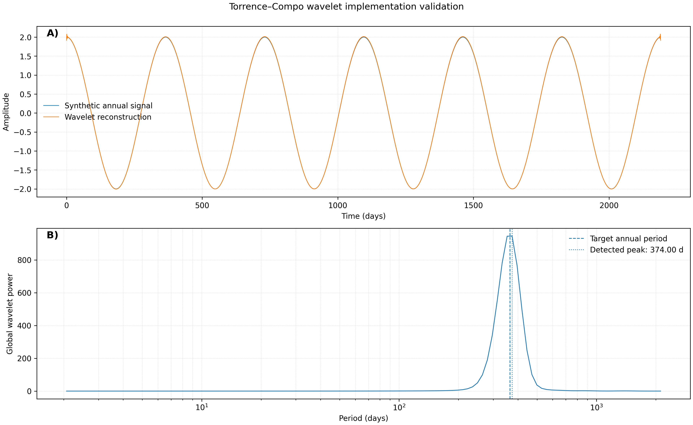

  

## Using authentic data to better understand Earth's climate system.

----------------------------------------------------
# Hi, I'm Fabio
----------------------------------------------------

Climate Scientist • Oceanographer • Scientific Python Developer

Welcome to my GitHub profile!

I develop reproducible Python tools for climate variability, ocean–atmosphere interactions, and oceanographic data analysis, with a focus on ENSO variability, the Pacific Warm Pool, time-series analysis, statistical modelling, and scientific visualization. My goal is to combine scientific research, open-source software, and education to better understand climate variability and make authentic climate data more accessible.

----------------------------------------------------
## Featured Projects
----------------------------------------------------

### ENSO Time-Series Analysis & SST Mapping
Professional Python pipeline for analysing OISST using global observational datasets.

*   **Methodology:** Processed global Sea Surface Temperature (SST) to identify spatial thermal patterns linked to ocean-atmosphere interactions, highlighting the historical 1998 Strong El Niño event.
*   **Technical Stack:** Python (`Xarray`, `NetCDF4`, `Cartopy`, `Matplotlib`, assisted by advanced AI prompt engineering).
*   [👉 View Climate Visualization](pwp_domain_definition_19980331.png)

---

### Pacific Warm Pool (PWP) Dynamics, STL Decomposition & Wavelets
Investigating the annual and interannual variability of the Pacific Warm Pool (area and centroid longitude) using advanced climate diagnostics, non-linear signal processing, and rigorous algorithm validation.

*   **Methodology:** Applied Continuous Wavelet Transform (CWT) to isolate low-frequency variability and track physical shifts in the PWP centroid boundaries, zonal core migration, and surface area. Implemented **STL Decomposition (Seasonal & Trend decomposition using LOESS)** to robustly decouple long-term climate change trends from seasonal cycles and stochastic anomalies.
*   **Algorithm Verification:** Developed a robust **Synthetic Validation Pipeline** featuring known multi-frequency signals and stochastic noise components to benchmark, calibrate, and verify the accuracy of the Wavelet spectral decomposition code before deploying it on raw observational datasets.
*   **Technical Stack:** Python (`Statsmodels.tsa.seasonal.STL`, `PyWavelets`, `Xarray`, `SciPy.signal`, `Matplotlib`).

#### Climate Signal Diagnostics & Code Validation:
*   [👉 View STL Decomposition - PWP Total Area Expansion](pwp_stl_area.png)
*   [👉 View STL Decomposition - Longitude Core Shifts](pwp_stl_longitude.png)
*   [👉 View Wavelet Power Spectrum - Area Variability](pwp_wavelet_tc_area.png)
*   [👉 View Wavelet Power Spectrum - Longitude Core Shifts](pwp_wavelet_tc_longitude.png)
*   [👉 View Pipeline Code Verification - Synthetic Wavelet Validation Chart](pwp_wavelet_tc_synthetic_validation.png)

---

### Coastal Engineering & Climate Adaptation (New Zealand)

#### 1. Coastal Inundation Risk & Sea-Level Rise Mapping (Onerahi, Whangārei Harbour)
*   **Objective:** Identify low-lying civil infrastructure vulnerable to the joint impacts of IPCC Sea-Level Rise (SLR) scenarios and extreme storm surge events up to the year 2100 within the Whangārei Harbour.
*   **Engineering Outcomes:** Established a critical design flood level threshold of **3.00 meters** via spatial masking workflows. The diagnostics revealed that **74.7%** of the evaluated low-elevation coastal boundary sits within high-risk asset loss zones if nature-based infrastructure solutions or engineered seawalls are not implemented.
*   **Technical Stack:** Python (`NumPy`, `Pandas`, `Matplotlib`).
*   [👉 View Source Code](coastal_flooding_analysis.py) | [👉 View Hazard Map Visualization](whangarei_coastal_flooding_map.png)

#### 2. Extreme Wave Climate Modeling & Design Limit Analysis (Bream Bay, Northland)
*   **Objective:** Establish the historical wave climate baseline to determine structural design constraints and engineering tolerances for local offshore energy and marine infrastructure developments.
*   **Operational Insights:** Processed hourly significant wave height data ($H_s$) to calculate the **95th Percentile extreme operating limit ($H_s = 2.45\text{m}$)**. Modeled severe winter storm anomalies to evaluate structural asset survivability against peak wave impacts reaching **4.41 meters**.
*   **Technical Stack:** Python (`NumPy`, `Pandas`, `Matplotlib`).
*   [👉 View Source Code](wave_analysis.py) | [👉 View Wave Diagnostics Chart](bream_bay_wave_analysis.png)

---

### Climate Data for Education
Educational resources and interactive pipelines demonstrating how authentic, large-scale climate datasets can be used to teach advanced statistics, time-series decomposition, and data science.

*   **Methodology:** Developed curriculum-ready visualization workflows focusing on signal extraction. The core module acts as a visual teaching aid to demonstrate climate variance, helping students isolate the underlying global warming trend from seasonal and interannual noise.
*   **Technical Stack:** Python (`Pandas`, `Statsmodels`, `Matplotlib`), Signal Decomposition, Climate Literacy.
*   [👉 View Educational Python Pipeline](wave_analysis.py)

----------------------------------------------------
## Research Interests
----------------------------------------------------

_El Niño–Southern Oscillation 
      and Climate variability_

_Ocean-Atmosphere interaction_

_Physics of the Ocean_

_Ocean heat content_

_Pacific Warm Pool dynamic_

_Dynamics of the Atmosphere_

_Oceanographic Instrumentation_

_AUV High resolution 
      data processing and collection_ 

_Sea floor Information System_

----------------------------------------------------
## Featured Projects
----------------------------------------------------

_Scientific computing 
      with Python and Matlab_

_Wavelet analysis and 
      scale-averaged wavelet variance 
            for non-stationary dataset_

_Time-series analysis, seasonal variations, 
      long-term trends and forecasting_ 

_Sea Surface Temperature (SST) analysis_

_Evenly spaced observation fields 
      from irregularly sampled data_

_Hydrographic high resolution 
      data processing (MBE, SVP, CTD)_

_AUV high-resolution survey_

_Climate education 
      using authentic datasets_

### ENSO Time-Series Analysis

_Pacific Warm Pool Scale-Dependent Variability_

_Threshold-Dependent Expansion, Seasonality, and 
      Spatial Reorganization of the Pacific Warm Pool_

_ENSO indices analysis_

## Pacific Warm Pool

_Pacific Warm Pool dynamics_

_ENSO event classification and 
        temporal evolution of Pacific warm-pool geometry_

_Integrated sequence of 
        tropical-Pacific reorganization_

_Investigating annual and 
        interannual variability of the Pacific Warm Pool_

_Pacific Warm Pool
    surface-area variability and long-term change_

---

## Climate Data for Education

_Authentic climate datasets 
      as Educational resources for 
            the teaching of statistics in high school_

----------------------------------------------------
## Skills
----------------------------------------------------

_NavLab_
_Git
_GitHub_

## Programming

_Python_
_MatLab_

## Scientific Python

_NumPy_
_Pandas_
_SciPy_
_Statsmodels_
_Matplotlib_

## More

_VS Code_
_Jupyter_
_NOAA Climate Data_
_Machine Learning_

----------------------------------------------------
## Current Work
----------------------------------------------------

Currently developing open and reproducible software for:

_Daily Sea Surface 
      Temperature analysis (1981–present)_

_ENSO monitoring and analysis_

_Pacific Warm Pool variability_

_Scientific software for 
      research and education_

_Python climate analysis toolkit_

_Educational resources using 
      authentic climate datasets_

_Pacific Warm Pool 
      Scale-Dependent Variability_

_Threshold-Dependent Expansion, Seasonality, 
      and Spatial Reorganization of the Pacific Warm Pool_

## Scientific Workflow

Climate Data

↓

Quality Control

↓

Statistical Analysis

↓

Time-Series Modelling

↓

Wavelet analysis

↓

Forecasting

↓

Scientific Visualisation

↓

Publication

----------------------------------------------------
GitHub Statistics
----------------------------------------------------

This GitHub account documents the development of scientific software, climate analysis workflows, and educational resources. Each repository is designed to be reproducible, well documented, and suitable for both research and teaching.

- contribution activity

- language usage

- repository statistics

- streaks

- trophies

These update automatically.

----------------------------------------------------
## Philosophy
----------------------------------------------------

I believe that scientific research should be:

Reproducible
Transparent
Open-source
Well documented
Accessible to researchers, educators, and students

----------------------------------------------------
##  Contact
----------------------------------------------------

Email: fvmachado.oceanscience@gmail.com./.

ORCID: https://orcid.org/0000-0003-0723-075X ./.

Google Scholar: https://scholar.google.com/citations?hl=en&user=RkFTqu8AAAAJ ./.

LinkedIn ./.

Outside research, I enjoy Brazilian Jiu-Jitsu, surfing, bodyboarding, and spending time at the beach
