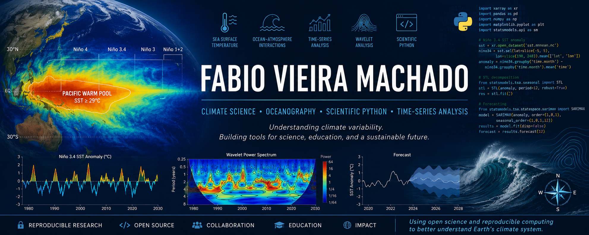

  

## Using open science and reproducible computing to better understand Earth's climate system.

----------------------------------------------------
# Hi, I'm Fabio Vieira Machado 👋
----------------------------------------------------

Climate Scientist • Oceanographer • Scientific Python Developer

Welcome to my GitHub profile!

I develop reproducible Python tools for climate variability, ocean–atmosphere interactions, and oceanographic data analysis, with a focus on ENSO variability, the Pacific Warm Pool, time-series analysis, statistical modelling, and scientific visualization. My goal is to combine scientific research, open-source software, and education to better understand climate variability and make authentic climate data more accessible.

----------------------------------------------------
## About Me
----------------------------------------------------

I am interested in understanding the physical mechanisms that govern climate variability using observational datasets, statistical methods, and scientific computing.

My work combines:

- Physical Oceanography
- Climate Variability
- ENSO Dynamics
- Time-Series Analysis
- Scientific Python

----------------------------------------------------
## Research Interests
----------------------------------------------------

Climate variability
El Niño–Southern Oscillation (ENSO)
Pacific Warm Pool dynamics
Sea Surface Temperature (SST) analysis
Time-series analysis and forecasting
Wavelet analysis
Statistical modelling
Scientific computing with Python
Climate education using authentic datasets

----------------------------------------------------
## Featured Projects
----------------------------------------------------

ENSO Time-Series Analysis

Pacific Warm Pool

Climate Data for Education

### 🌊 ENSO Time-Series Analysis

Professional Python pipeline for analysing and forecasting Niño SST indices.

---

## Pacific Warm Pool

Investigating annual and interannual variability of the Pacific Warm Pool.

Research tools investigating the spatial and temporal variability of the Pacific Warm Pool, including centroid analysis, wavelet methods, and climate diagnostics.

---

## Climate Data for Education

Educational resources demonstrating how authentic climate datasets can support the teaching of statistics and data science.

----------------------------------------------------
## Skills
----------------------------------------------------

## Programming

Python
MatLab
NavLab
Git
GitHub

## Scientific Python

NumPy
Pandas
SciPy
Statsmodels
Matplotlib

## Research Areas

Time-Series Analysis
Climate Data Analysis
Statistical Forecasting
Ocean–Atmosphere Interactions
Scientific Visualization
Phase diagram
Wavelet analysis

## More

VS Code
Jupyter
NOAA Climate Data
Machine Learning

----------------------------------------------------
## Current Work
----------------------------------------------------

Project: Warm Pool & ENSO Time-Series Analysis

## Scientific Workflow

Climate Data

↓

Quality Control

↓

Statistical Analysis

↓

Time-Series Modelling

↓

Wavelet analysis

↓

Forecasting

↓

Scientific Visualisation

↓

Publication

## Currently Working On

I am currently developing open and reproducible software for:

Daily Sea Surface Temperature analysis (1981–present)
ENSO monitoring and forecasting
Pacific Warm Pool variability
Climate time-series modelling
Scientific software for research and education

- Daily SST analysis (1981–present)
- ENSO monitoring forecasting
- Pacific Warm Pool dynamics
- Python climate analysis toolkit
- Educational resources using authentic climate datasets

----------------------------------------------------
GitHub Statistics
----------------------------------------------------

This GitHub account documents the development of scientific software, climate analysis workflows, and educational resources. Each repository is designed to be reproducible, well documented, and suitable for both research and teaching.

- contribution activity

- language usage

- repository statistics

- streaks

- trophies

These update automatically.

----------------------------------------------------
## Philosophy
----------------------------------------------------

I believe that scientific research should be:

Reproducible
Transparent
Open-source
Well documented
Accessible to researchers, educators, and students

----------------------------------------------------
##  Contact
----------------------------------------------------

Email: fvmachado.oceanscience@gmail.com
Google Scholar
ORCID
LinkedIn

Outside research, I enjoy Brazilian Jiu-Jitsu, surfing, bodyboarding, and spending time at the beach