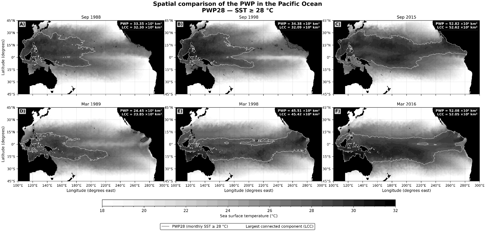
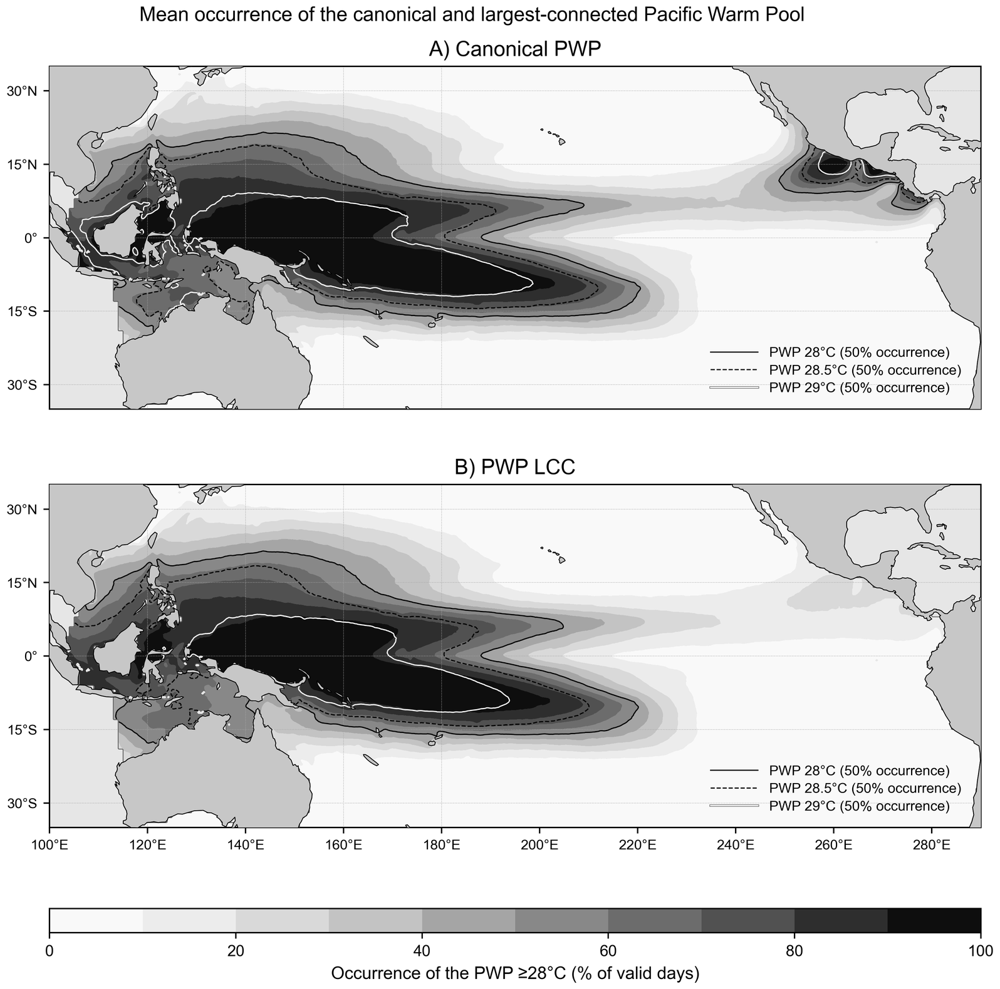
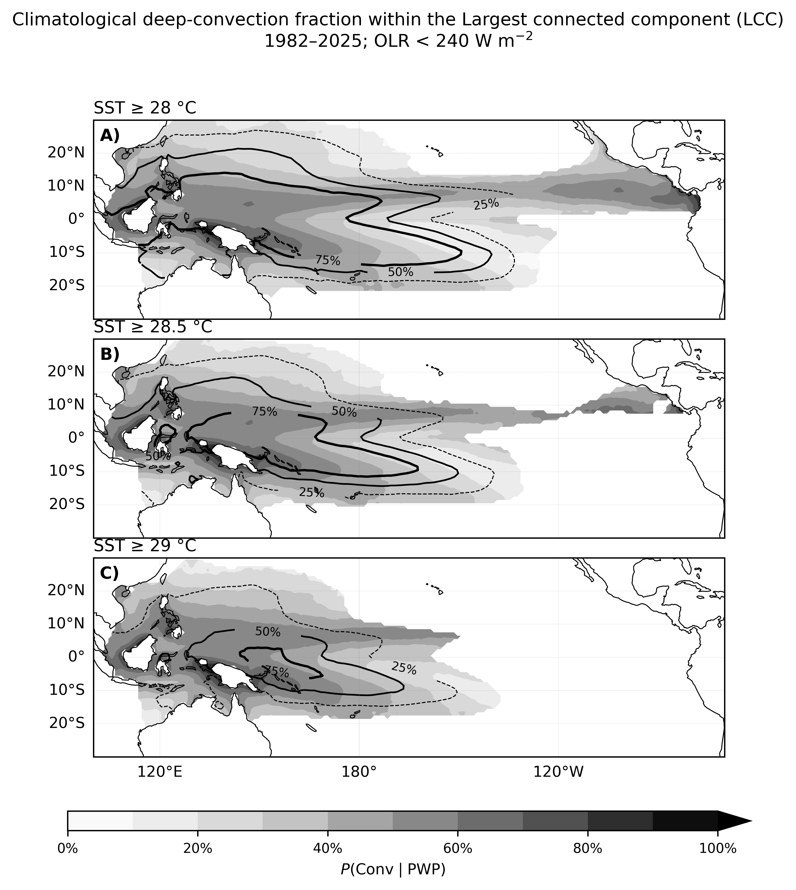

  

<h1 align="center">Fabio Vieira Machado</h1>

  <strong>Oceanographer | Hydrographic & Offshore Survey | Metocean | Scientific Data</strong> 
  <em>From measurements at sea to defensible scientific information.</em>

  <strong>20+ years spanning offshore survey operations, oceanographic observations, marine geophysics, subsea project support, scientific data analysis, and climate research.</strong>

  Based in New Zealand | Available for consulting, project-based, and fixed-term assignments nationally and internationally

  <a href="mailto:fvmachado.oceanscience@gmail.com">Email</a> ·
  <a href="https://orcid.org/0000-0003-0723-075X">ORCID</a> ·
  <a href="https://github.com/blackbeltbjj">GitHub</a>

---

## Contents

- [About Me](#about-me)
- [Core Professional Expertise](#core-professional-expertise)
- [Hydrographic, AUV & Offshore Survey](#hydrographic-auv--offshore-survey)
- [Oceanographic Instrumentation & Field Operations](#oceanographic-instrumentation--field-operations)
- [Scientific Computing & Environmental Data](#scientific-computing--environmental-data)
- [Research, Software & Reproducibility](#research-software--reproducibility)
- [Offshore & Marine Survey Career](#offshore--marine-survey-career)
- [Education & Training](#education--training)
- [Early Career & Research Foundation](#early-career--research-foundation)
- [Scientific Communication & Teaching](#scientific-communication--teaching)
- [Contact](#contact)

---

## About Me

### Professional Profile

I am an oceanographer, hydrographic survey professional, and scientific data specialist whose career bridges high theoretical knowledge, vast field operations experience, project coordination, and quantitative science.

My experience spans satellite oceanography and climate research, scientific computing, reproducible ocean and climate research, vessel-based hydrographic and marine-geophysical surveys, AUV/HUGIN and multibeam operations, acoustic positioning, oceanographic instrumentation, subsea project support, and environmental observations.

I have worked across the complete data lifecycle:

> **Sensor deployment → positioning → real-time acquisition → processing → QA/QC → analysis → interpretation → technical and scientific reporting**

This combination allows me to understand climate, environmental and survey data not simply as numerical products, but as measurements shaped by instrumentation, positioning, environmental conditions, acquisition procedures, and physical processes.

### Professional Snapshot

| Area | Profile |
|---|---|
| **Primary fields** | Physical Oceanography · Fluid mechanics · Metocean · Environmental Data Science · Hydrographic Survey |
| **Operational background** | Offshore survey · AUV/HUGIN · Multibeam · Subsea positioning · Oceanographic instrumentation |
| **Scientific background** | Climate variability · ENSO · Pacific Warm Pool · Satellite oceanography · Time-series analysis |
| **Computational practice** | Python · MATLAB · NetCDF · Scientific QA/QC · Git/GitHub · Reproducible research |
| **Current base** | New Zealand; available for national and international projects |

### Work With Me

I am open to consulting, project-based, and fixed-term assignments where oceanographic knowledge, offshore experience, and quantitative data analysis can contribute to solving scientific or operational problems.

- Scientific Python development and legacy scientific-data modernisation
- Climate and ocean time-series analysis
- Marine and metocean data analysis
- Oceanographic observational programmes and environmental monitoring
- Research software, reproducibility, and research-data management
- Technical and scientific reporting
- Hydrographic and oceanographic data QA/QC
- Hydrographic, offshore, and marine geophysical survey projects
- AUV/HUGIN and subsea survey operations
- Scientific collaboration and education using authentic environmental observations

**New Zealand and international projects welcome.**

---

## Core Professional Expertise

### Professional Capabilities

| Hydrographic & Offshore Survey | Oceanography & Metocean | Scientific Data |
|---|---|---|
| Multibeam bathymetry | Physical oceanography | Python & MATLAB |
| AUV/HUGIN operations | CTD/SVP observations | Large environmental datasets |
| High-resolution AUV surveys | ADCP/current measurements | NetCDF and gridded data |
| Seabed mapping | Oceanographic moorings | Statistics and time series |
| Side-scan sonar | Waves and currents | Fourier and wavelet analysis |
| Sub-bottom profiling | Satellite oceanography | Spatial analysis |
| Offshore/subsea positioning | SST, ENSO, climate variability | Scientific visualisation |
| Pipeline and as-built surveys | Environmental monitoring | Automated QA/QC |
| Dredging and backfilling | Marine observations | Reproducible workflows |

### Areas of Professional Interest

- **Ocean and environment:** Physical oceanography, metocean, oceanographic instrumentation, environmental monitoring, and ocean observations
- **Climate science:** Climate variability, ENSO, Pacific Warm Pool, and satellite oceanography
- **Computing and data:** Scientific Python, environmental data science, time-series analysis, and spatial analysis
- **Research practice:** Reproducible research, scientific software, and research-data management
- **Survey and offshore:** Hydrographic survey, offshore survey, marine geophysics, underwater acoustics, subsea positioning, and AUV operations

---

## Hydrographic, AUV & Offshore Survey

### Survey & Processing Software

`CARIS HIPS/SIPS` · `Kongsberg SIS` · `Hydromap Multibeam` · `Fledermaus` · `NavLab` · `Hypack/Hysweep`

### Survey Applications

- Hydrographic and marine-geophysical surveys
- Multibeam bathymetry and high-resolution seabed mapping
- AUV high-resolution survey acquisition and processing
- Real-time and post-processed hydrographic data
- Side-scan sonar and sub-bottom profiling
- Pipeline-route, pre-lay, post-lay, and as-built surveys
- Shore approaches, dredging, and backfilling monitoring
- Offshore navigation and acoustic positioning
- Environmental survey support
- Survey planning, field execution, QA/QC, and technical reporting

### Acoustic Positioning & Subsea Navigation

`Kongsberg HiPAP` · `APOS` · `C-NAV DGPS` · `USBL` · `LBL` · `AUV/HUGIN`

Experience with offshore navigation, subsea acoustic positioning, and autonomous survey operations, including AUV mission support and integration of navigation, positioning, and survey data. My background in physical oceanography and underwater acoustics provides additional understanding of environmental influences on sound propagation and subsea positioning.

### Multibeam, Sonar & Marine Geophysical Systems

`Kongsberg EM 2042` · `EM 2040 MKII` · `EM 712/712S` · `EM 710` · `EM 302` · `EM 3000`

`MBES` · `Side-Scan Sonar` · `Sub-Bottom Profiler` · `Marine Geophysics`

Applications have included high-resolution seabed mapping, pipeline and subsea-infrastructure surveys, route investigation, environmental surveys, and offshore project support.

---

## Oceanographic Instrumentation & Field Operations

### CTD Systems & Sensors — Sea-Bird Scientific

#### Systems and sensors

- SBE 19+ SeaCAT and SBE 19+ V2 SeaCAT
- SBE 3+ Temperature, SBE 4+ Conductivity, and SBE 5e Pump
- SBE 37 MicroCAT

#### Acquisition, processing, and operations

- **Software:** SeaTerm, Seasave, and SBE Data Processing
- **Activities:** Instrument configuration, CTD deployment, real-time acquisition, data conversion, filtering, alignment, QA/QC, and interpretation of physical-oceanographic profiles

### ADCP, Currents & Mooring Systems

#### Systems and software

- **Systems:** Teledyne RDI Workhorse Long Ranger 75 kHz; Workhorse Sentinel 300, 600, and 1200 kHz; Nortek Aquadopp Profiler/Current Meter
- **Software:** PlanADCP, WinADCP, WinSC, and BBTalk

#### Operational experience

- ADCP and DVL acquisition and processing
- Current profiling and oceanographic mooring installation and recovery
- Instrument configuration and acoustic releases
- Wave/current observations, environmental monitoring, and QA/QC

### Marine Sampling & Observational Systems

Multi-bottle rosette systems · Nansen bottles · Plankton nets · Box-core sediment samplers · Oceanographic moorings · Wave buoys · CTD/SVP casts · Current-meter deployments

Working directly with instruments and field observations provides important context when assessing the quality, uncertainty, and physical meaning of environmental datasets.

---

## Scientific Computing & Environmental Data

### Languages & Environments

`Python` · `MATLAB` · `Unix/Linux` · `Windows` · `Git` · `GitHub` · `Jupyter` · `VS Code`

### Python Scientific Stack

`NumPy` · `pandas` · `SciPy` · `xarray` · `Statsmodels` · `Matplotlib` · `PyWavelets`

### Analytical Capabilities

- Large multidimensional ocean and climate datasets
- NetCDF and gridded geophysical observations
- Satellite sea-surface temperature and geospatial analysis
- Statistical, spatial, and time-series analysis
- Spherical geometry and connected-component analysis
- Fourier, wavelet, Welch power spectral density, and continuous wavelet transforms
- STL decomposition and robust trend estimation
- Occurrence and persistence analysis
- Scientific visualisation and automated QA/QC
- Scientific provenance and reproducible computational workflows

---

## Research, Software & Reproducibility

My current research links scientific manuscripts with version-controlled computational workflows, audited software releases, and persistent archival records where available.

### Featured Research Portfolio

| Research programme | Scientific focus | Software and archive | Status |
|---|---|---|---|
| **PWP threshold definition and centroid geometry** | Effects of 28.0, 28.5, and 29.0 °C definitions on warm-pool geometry and variability | [OSAF-PWP](https://github.com/blackbeltbjj/OSAF-PWP) · [Sensitivity repository](https://github.com/blackbeltbjj/pwp-threshold-centroid-sensitivity) · Zenodo DOIs | JTECH submission, 18 Aug 2026 |
| **PWP28 area expansion and spatial organisation** | Daily area, trend, seasonality, variability, connectivity, and fragmentation | Private reproducibility repository during review | RBMet submission, 28 Aug 2026 |
| **Largest connected Pacific Warm Pool** | Long-term expansion and increasing spatial coherence across SST thresholds | [pwp-lcc-spatial-coherence](https://github.com/blackbeltbjj/pwp-lcc-spatial-coherence) · [Zenodo](https://doi.org/10.5281/zenodo.22499662) | Journal of Climate submission, 6 Sep 2026 |
| **Convective enrichment** | Threshold-dependent relationship between warm-pool structure and deep convection | [pwp-convective-enrichment](https://github.com/blackbeltbjj/pwp-convective-enrichment) · [Zenodo](https://doi.org/10.5281/zenodo.22857851) | Theoretical and Applied Climatology submission, Sep 2026 |

### Pacific Warm Pool — Threshold Definition & Centroid Geometry

#### Manuscript and scope

**Manuscript:** *Defining the Pacific Warm Pool: Threshold Dependence of Centroid Geometry and Robustness of Interannual Variance Modulation*  
**Journal:** Journal of Atmospheric and Oceanic Technology  
**Status:** Submitted 18 August 2026

The study examines how 28.0, 28.5, and 29.0 °C SST definitions alter diagnosed Pacific Warm Pool area, centroid position, spatial geometry, and displacement, while assessing the robustness of interannual variance modulation across thresholds.

#### Scientific software and data

- [OSAF-PWP](https://github.com/blackbeltbjj/OSAF-PWP), v1.0.0 — [Zenodo DOI](https://doi.org/10.5281/zenodo.21964951)
- [pwp-threshold-centroid-sensitivity](https://github.com/blackbeltbjj/pwp-threshold-centroid-sensitivity), v1.0.0 — [Zenodo DOI](https://doi.org/10.5281/zenodo.21964955)
- Derived Data v1.0.0 — [Zenodo DOI](https://doi.org/10.5281/zenodo.21976955)

#### Methods

Spherical geometry · Physical-area weighting · Threshold sensitivity · Centroid analysis · Connectivity · Wavelets · Occurrence and persistence

  

### Pacific Warm Pool — 28 °C Area Expansion & Spatial Organisation

#### Manuscript and scope

**Manuscript:** *Variability, Expansion and Spatial Organisation of the 28 °C Pacific Warm Pool from 1981 to 2026*  
**Journal:** Revista Brasileira de Meteorologia  
**Status:** Submitted 28 August 2026; anonymous review

The study examines daily PWP28 area, long-term expansion, seasonality, temporal variability, and spatial connectivity using NOAA OISST v2.1. The supporting repository is maintained privately during review.

#### Methods and reproducibility

Daily area · Long-term trend · Seasonal cycle · Interannual variability · Time-frequency analysis · Connectivity and fragmentation · Scientific QA/QC

  

### Pacific Warm Pool — Largest Connected Component

#### Manuscript and scope

**Manuscript:** *Expansion and Increasing Spatial Coherence of the Largest Connected Pacific Warm Pool, 1981–2026*  
**Journal:** Journal of Climate  
**Status:** Submitted 6 September 2026

The study investigates the long-term evolution of the largest spatially connected warm-water component across multiple SST thresholds, integrating trends, seasonality, spectral variability, spatial occurrence, and connectivity diagnostics.

#### Scientific software and archive

- **Scientific software:** [pwp-lcc-spatial-coherence](https://github.com/blackbeltbjj/pwp-lcc-spatial-coherence)
- **Release:** v1.0.0 — Scientific/Reproducibility Freeze
- **Archive:** [Zenodo DOI](https://doi.org/10.5281/zenodo.22499662)

#### Methods

Connected-component analysis · Theil–Sen trends · STL · Welch power spectra · Continuous wavelets · Occurrence and persistence

  

### Pacific Warm Pool — Convective Enrichment

#### Manuscript and scope

**Manuscript:** *Threshold-Dependent Convective Enrichment of the Pacific Warm Pool, 1982–2025*  
**Journal:** Theoretical and Applied Climatology  
**Status:** Submitted September 2026

The study examines how SST threshold choice affects the diagnosed relationship between Pacific Warm Pool structure and deep convection over 1982–2025, using NOAA OISST v2.1 and NOAA Daily OLR CDR v2.0.

#### Scientific software and archive

- **Scientific software:** [pwp-convective-enrichment](https://github.com/blackbeltbjj/pwp-convective-enrichment)
- **Release:** v1.0.0 — Reproducibility Package
- **Archive:** [Zenodo DOI](https://doi.org/10.5281/zenodo.22857851)

#### Methods

SST-threshold analysis · Deep-convection diagnostics · OLR · Connected-component analysis · Equatorial geometry · ENSO relationships

  

### Southern Ocean Observational Data

#### Project overview

At the University of Auckland Centre for eResearch, I worked with irregularly sampled Southern Ocean observations, including Argo profiling-float and animal-borne observations, supporting the development of regularly gridded observational fields and climatological products.

- **Repository:** [argo](https://github.com/blackbeltbjj/argo)
- **Methods:** Argo profiling floats · Animal-borne observations · Irregular sampling · Filtering · Gridding · Climatological products

#### Climatological products

<strong>Climatological Salinity Field</strong> Resolution: 1° × 1°

  

<strong>Climatological Temperature Field</strong> Resolution: 1° × 1°

  

### Reproducibility Practice

My current scientific workflows incorporate:

- Version-controlled source code and explicit scientific configuration
- Environment and dependency records
- Input and output inventories
- Automated quality control and numerical validation
- Metadata capture and SHA-256 integrity manifests
- Tagged software releases and persistent archival records
- Documented provenance from observations to publication products

---

## Publications & Scientific Development

### Peer-Reviewed Publications

1. **Machado, F. V., & d'Avila, V. A. (2014).** O centroide da piscina de água quente do Pacífico como um indicador dos fenômenos El Niño e La Niña. *Revista Brasileira de Meteorologia, 29*, 443–456. [https://doi.org/10.1590/0102-778620130595](https://doi.org/10.1590/0102-778620130595)
2. **Machado, F. V., & d'Avila, V. A. (2006).** A trajetória e a área da piscina de água quente do Pacífico. *Revista Brasileira de Meteorologia, 21*, 161–169.

### Conference Proceedings & Scientific Software

**d'Avila, V. A., & Machado, F. V. (2004).** Programa para a visualização da grade de temperatura superficial dos oceanos e edição de máscaras numéricas continentais. *Congresso Brasileiro de Meteorologia — CBMet, Proceedings.*

This early work involved developing software to visualise ocean surface-temperature grids and manipulate numerical continental masks.

### From Early Satellite Oceanography to Reproducible Scientific Software

My Pacific climate research began during undergraduate work in Physical Oceanography. In 1999–2000, a FAPERJ-supported project at the State University of Rio de Janeiro involved developing C++ and Fortran software to process NOAA/AVHRR sea-surface temperature observations, calculate Pacific Warm Pool area and centroid, analyse time series, generate scientific graphics, and communicate results through reports and seminars.

Today, related scientific questions are being revisited using daily high-resolution satellite observations, Python, spherical geometry, spatial-connectivity analysis, modern time-frequency methods, version control, and reproducible research infrastructure.

> **Satellite SST and C++/Fortran → PWP/ENSO research → Offshore oceanography → AUV/HUGIN and multibeam → Subsea projects → Southern Ocean data → Python and reproducible climate science**

---

## Offshore & Marine Survey Career

My offshore career progressed from navigation, processing, and survey-support responsibilities to hydrographic surveying, Offshore Operations Party Chief responsibilities, metocean operations, AUV/HUGIN and multibeam operations, marine-geophysical real-time data analysis, senior oceanographic work, field supervision, client-side technical support, and project coordination.

### C&C Technologies do Brasil

#### Hydrographic, AUV, and metocean responsibilities

- Hydrographic and marine-geophysical surveys
- Offshore Operations Party Chief responsibilities
- AUV/HUGIN high-resolution survey operations
- HiPAP acoustic positioning and offshore navigation
- Multibeam acquisition, processing, and real-time geophysical analysis
- Metocean services and physical-oceanographic observations
- ADCP/DVL data, environmental-programme support, field QA/QC, and procedures

### Petrobras

#### Marine survey and project responsibilities

- Marine survey and oceanographic work packages
- Bathymetric, positioning, and environmental datasets
- Vessel and contractor activities
- HSE, quality control, procedures, and risk assessments
- Technical reporting and multidisciplinary project coordination

### Subsea Consult

#### Subsea survey and client-support responsibilities

- Pipeline-route and subsea-infrastructure surveys
- Pre-lay, post-lay, as-built, freespan, and shore-approach work
- Dredging and backfilling projects
- AUV high-resolution geophysical surveys
- Oceanographic moorings and ADCP deployments
- Client representation, technical reporting, and field support

---

## Education & Training

### Academic Education

#### MSc — Meteorology / Atmospheric Sciences

**University of São Paulo — USP, Brazil**  
Advanced postgraduate study in atmospheric and climate sciences, including atmospheric dynamics, meteorology, micrometeorology, climate variability, and ocean–atmosphere processes. **NZQA assessed equivalent: New Zealand Level 9 Master's degree.**

#### Postgraduate Study — Ocean & Earth Dynamics

**Fluminense Federal University — UFF, Brazil**  
Advanced study related to ocean and Earth-system dynamics, including marine and geophysical processes.

#### BSc — Oceanography

**State University of Rio de Janeiro — UERJ, Brazil | 2002**  
Professional education across physical, chemical, biological, and geological oceanography, hydrography, marine observations, and environmental sciences, supported by mathematics, statistics, and physics.

### Scientific & Quantitative Foundation

- **Ocean and atmosphere:** Fluid dynamics, wind waves, physics of the ocean, atmospheric dynamics, micrometeorology, turbulence, and remote sensing
- **Ocean sciences:** Physical, chemical, biological, and geological oceanography; marine geophysics; hydrography; water-mass analysis; astronomy and navigation
- **Coastal and marine sciences:** Estuarine oceanography, marine pollution, coastal processes, ecology, hydrodynamic modelling, tides, and cartography
- **Climate sciences:** Meteorology, climatology, climate variability, ocean–atmosphere interaction, stochastic processes, and observational methods
- **Mathematics and statistics:** Advanced calculus, statistics, differential equations, time-series analysis, spherical trigonometry, and data processing

### Advanced Scientific & Professional Training

- Instability Problems — LNCC (2003)
- Summer School in Geophysics — National Observatory / Ministry of Science and Technology, Brazil
- Mid-Ocean Ridge Geophysics — LAGEMAR/UFF and Université de Bretagne Occidentale
- Estuarine Oceanography — Oceanographic Institute, University of São Paulo
- Physical Oceanography of the South Atlantic — Federal University of Rio Grande
- Satellite Oceanography
- CARIS HIPS — Hydrographic data-processing training
- Sea-Bird CTD — Instrument operation and data processing

---

## Early Career & Research Foundation

### Climate Group — CPTEC/INPE

#### Research Internship | 1999

**Research Internship | 1999**  
Early experience within the Climate Group at Brazil's Center for Weather Forecasting and Climate Studies, under the supervision of Dr. José Antonio Marengo Orsini.

### Physical Oceanography & Satellite Data — UERJ/FAPERJ

#### Undergraduate Research | 1999–2000

**Undergraduate Research | 1999–2000**  
Worked on the FAPERJ-supported project *A Mathematical Model for the El Niño Phenomenon*, using NOAA/AVHRR satellite SST observations, C++ and Fortran, Pacific Warm Pool area and centroid calculations, time-series analysis, scientific graphics, technical reports, and research presentations.

### Brazilian Navy — IEAPM

#### Oceanographic Data Processing Internship | 2000

**Oceanographic Data Processing Internship | 2000**  
Worked with physical-oceanographic data processing and computational routines associated with the marine environment and underwater sound propagation at the Almirante Paulo Moreira Institute of Sea Studies.

---

## Scientific Communication & Teaching

### Scientific & Research Communication

- **Oral presentations and seminars:** Brazilian Congress of Meteorology, LAC/INPE, and IAG-USP
- **Posters and conference presentations:** Brazilian Symposium of Oceanography, Brazilian Congress of Oceanography, Brazilian Congress of Meteorology, and ERMAC/SBMAC

### Teaching & Knowledge Transfer

- Mathematics, Statistics, Physics, and Science teaching in New Zealand
- Communication of quantitative and scientific concepts to audiences with different technical backgrounds
- Use of authentic environmental observations in mathematics, statistics, data analysis, and Earth-system science

Teaching has strengthened an important part of my professional practice: communicating quantitative and scientific concepts clearly to people with different technical backgrounds.

---

## Contact

For consulting, project-based work, research collaboration, or technical discussions:

- **Email:** [fvmachado.oceanscience@gmail.com](mailto:fvmachado.oceanscience@gmail.com)
- **ORCID:** [0000-0003-0723-075X](https://orcid.org/0000-0003-0723-075X)
- **GitHub:** [blackbeltbjj](https://github.com/blackbeltbjj)

  <strong>Ocean observations | Offshore operations | Scientific computing | Reproducible research</strong> 
  <em>From measurements at sea to defensible scientific information.</em>

